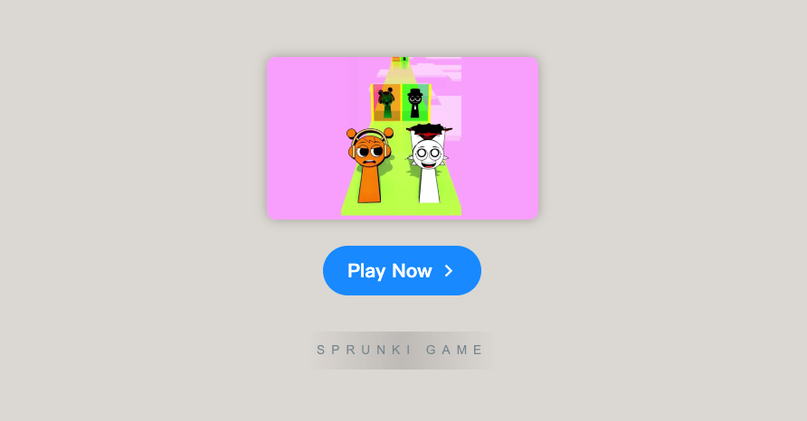

# Sprunki Romantic Mod

    

Welcome to **[Sprunki Romantic Mod](https://sprunkionline.com/category/sprunki-romantic)**, an enchanting musical experience within the world of Sprunki! This mod introduces a captivating and heartwarming storyline, combining Incredibox's core gameplay with a romantic adventure that follows the blossoming love between two beloved characters, Tunner and Simon. With delightful new sounds, dynamic visuals, and unique character interactions, Sprunki Romantic Mod brings a fresh twist to the classic Incredibox gameplay.

### Table of Contents
- Introduction
- Features
- Installation
- Gameplay Overview
- Popular Modes & Mods
- Tips for Success
- Resources

### Introduction

**[Sprunki Romantic Mod](https://sprunkionline.com/category/sprunki-romantic)** is a special edition mod that takes the beloved Incredibox gameplay and infuses it with a romantic twist. This mod follows the emotional journey of Tunner and Simon as they navigate their growing relationship, weaving a story of love and connection through music. Whether you're a longtime fan of Incredibox or new to the game, this mod offers a refreshing and immersive experience that combines the magic of romance with the creative freedom of musical composition.

### Features

| Feature                  | Description                                                                             |
|--------------------------|-----------------------------------------------------------------------------------------|
| **Romantic Storyline**    | Experience the heartwarming love story between Tunner and Simon as their relationship unfolds. |
| **Character Variety**     | Choose from a range of unique Sprunki characters, each adding a distinct musical layer to the romantic soundtrack. |
| **Interactive Gameplay**  | Drag-and-drop mechanics make sound layering and beat creation intuitive and fun.       |
| **Romantic Soundscapes**  | Soft melodies and soothing harmonies that enhance the romantic atmosphere.              |
| **Visually Charming Design** | Redesigned visuals with soft, colorful effects that reflect the romantic theme.         |
| **Free Access**           | No download needed—play directly in your browser for free.                             |
| **Community Sharing**     | Record and share your creations with friends or the wider Sprunki community.           |

### Installation

The **Sprunki Romantic Mod** is fully browser-based, so no installation is required. To start creating your beats and experiencing the romance, follow these simple steps:

1. **Open Your Browser**: Compatible with Chrome, Firefox, Safari, and other modern browsers.
2. **Visit the Website**:
    - [Sprunki Romantic Mod](https://sprunkionline.com/category/sprunki-romantic)
3. **Begin Playing**: Click "Play" to dive into the world of Sprunki and start mixing beats for your romantic story.

### Gameplay Overview

Sprunki Romantic Mod invites players to create layered musical compositions while following the emotional journey of Tunner and Simon. Here’s a quick guide to getting started:

1. **Select Characters**: Choose Tunner and Simon, each with unique sounds that contribute to the romantic theme.
2. **Drag and Drop**: Place characters on the soundboard to build your composition, layer by layer.
3. **Layer Sounds**: Combine characters to produce complex musical tracks with romantic melodies and soothing harmonies.
4. **Dynamic Visual Effects**: Enjoy charming animations that respond to the beats of your music and reflect the emotional journey of the characters.
5. **Record & Share**: Once your romantic masterpiece is complete, record your track and share it with the Sprunki community.

### Popular Modes & Mods

Explore other fan-favorite modes and mods to further customize your Sprunki experience:

- **Sprunki Infected Mod**: Experiment with darker, moodier beats with "infected" characters, adding a sinister twist to your compositions.
- **Sprunki Mustard Mod**: A fan favorite that introduces unique sound elements for added variety.
- **Sprunki Cocrea**: Engage with others by sharing and combining compositions in a collaborative setting.
- **Sprunki Parasprunki**: Layered interactions with parasitic characters for complex sound effects.

### Tips for Success

- **Experiment with Combinations**: Try out various character combinations to find new and interesting romantic sounds and melodies.
- **Watch Tutorials**: Find helpful guides on YouTube to master different phases and features of the *Sprunki Romantic Mod*.
- **Connect with the Community**: Share your compositions and get feedback from other players, or collaborate with others in the Sprunki community.

### Resources

Explore additional resources, mods, and communities to expand your Sprunki experience:

- [Sprunki Romantic Kiss Run Challenge](https://sprunkionline.com/sprunki-romantic-kiss-run-challenge)
- [Sprunki Romantic Challenge](https://sprunkionline.com/sprunki-romantic-challenge)

Enjoy creating your own musical masterpiece in **Sprunki Romantic Mod**! Whether you're crafting a heartfelt love song or exploring the unique features of the game, this mod offers a fresh and magical experience that combines romance and music in an unforgettable way.
